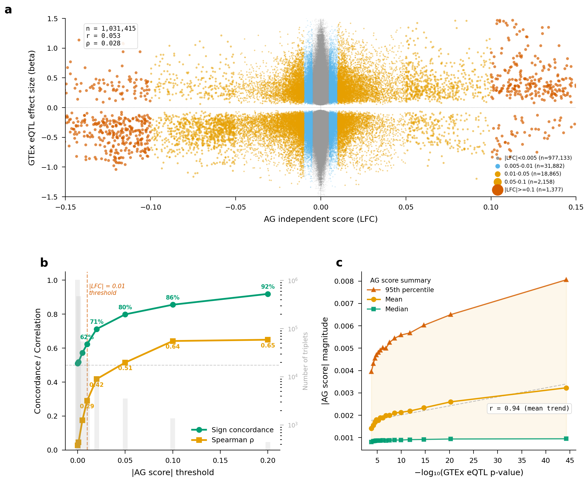
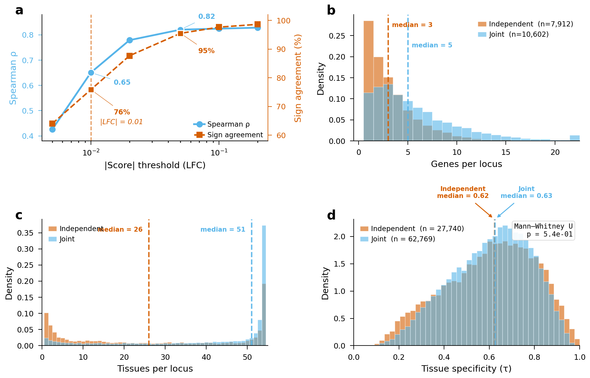
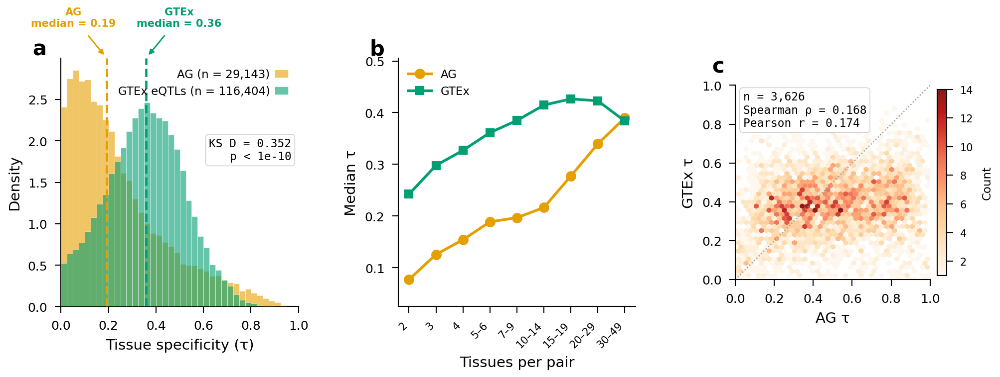
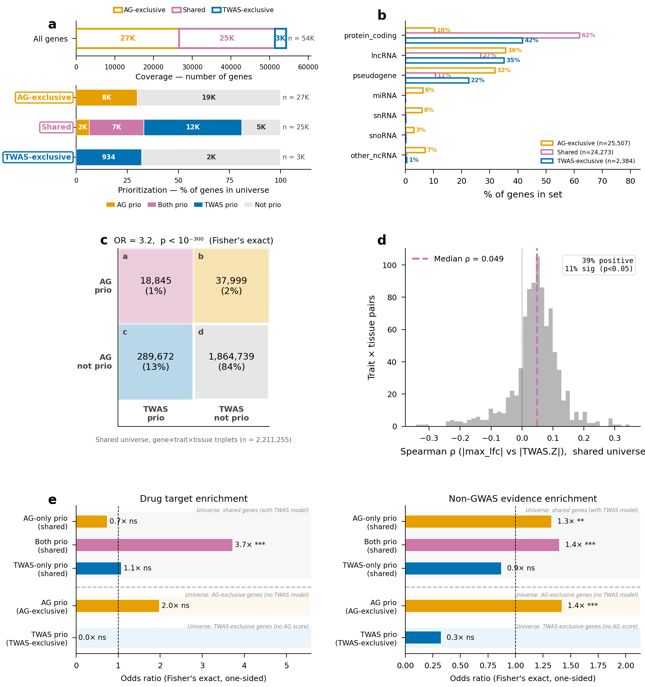
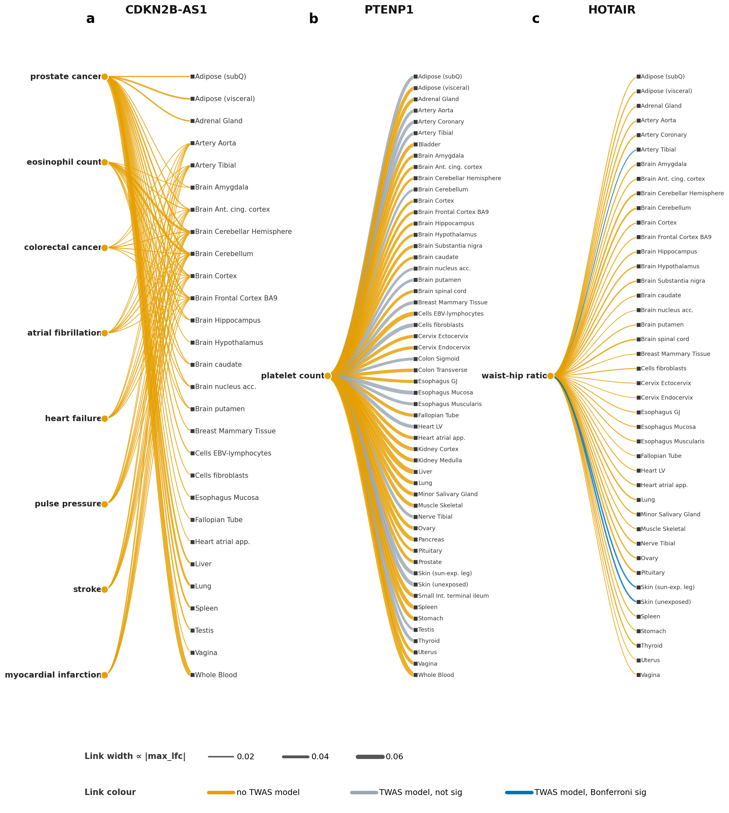

# alphagenome-twas

**Sequence-based regulatory prediction with AlphaGenome complements TWAS for GWAS gene prioritization beyond eQTL-model coverage.**

Xinyu Guo, Liang Chen — University of Southern California.

---

## TL;DR

Transcriptome-wide association studies (TWAS) are constrained to genes with trainable cis-eQTL models, leaving most non-coding genes — lncRNAs, pseudogenes, miRNAs — outside the reach of GWAS gene prioritization. We use **AlphaGenome**, a sequence-based deep-learning regulatory model, as an orthogonal route. Across **43 complex traits**, **11,456 fine-mapped loci**, and **60,511 credible-set SNPs**, we show that AlphaGenome and TWAS capture **largely orthogonal signal**, and AlphaGenome extends prioritization to **26,575 genes invisible to TWAS** — many with independent disease evidence.

## Key findings

1. **AlphaGenome predictions are confidence-calibrated.** Sign concordance with GTEx eQTL effects rises from chance (51%) at low magnitude to 92% at high-confidence predictions, giving practitioners a magnitude-based reliability filter (|LFC| ≥ 0.01).
2. **AlphaGenome and TWAS are orthogonal.** Despite enriched discovery-level overlap (OR = 3.19, Fisher p < 10⁻³⁰⁰), gene rankings (median ρ ≈ 0.049) and tissue-of-action assignments (25.9% vs 26.5% chance) disagree.
3. **AlphaGenome expands coverage.** Scores 51,335 genes vs 27,671 for TWAS; 26,575 genes are AG-exclusive, predominantly lncRNAs (36%) and pseudogenes (32%).
4. **AG-exclusive genes carry biological signal.** Enriched ~1.4× for OpenTargets non-GWAS disease evidence; TWAS-only genes show no such enrichment. Case studies at *CDKN2B-AS1*, *PTENP1*, and *HOTAIR* illustrate the gain.

## Figures

**Figure 1 — AlphaGenome predictions are calibrated against GTEx eQTLs.**



**Figure 2 — Per-SNP and joint multi-variant scoring converge at strong predicted effects.**



**Figure 3 — AlphaGenome captures tissue-specific regulation through a different lens than GTEx.**



**Figure 4 — AlphaGenome and TWAS are complementary for gene prioritization.**



**Figure 5 — AlphaGenome prioritizes functionally supported non-coding genes at GWAS loci.**



## Repository layout

```
analysis/
  persnp_vs_gtex/      AG calibration vs GTEx eQTLs              → Fig 1
  persnp_vs_joint/     Per-SNP vs joint AG scoring               → Fig 2
  tissue_specificity/  τ tissue specificity, AG vs GTEx          → Fig 3
  ag_twas/             AG vs TWAS: concordance, validation,
                       sig-groups, tissue-of-action              → Fig 4
manuscript/
  fig{1..5}_*.py       Figure-generating scripts
  fig_style.py         Shared matplotlib style
figures/               Final PNG renders (linked above)
```

Each `analysis/<module>/` contains:
- `analyze*.py` — compute intermediates from the merged AG–TWAS parquet
- `plot_*.py` — render per-panel diagnostics
- `plot_combined.py` — module-level multi-panel figure

## Usage

```bash
export AG_LD_ROOT=/path/to/data
python analysis/<module>/analyze.py        # produces intermediate CSVs / parquets
python manuscript/fig<N>_*.py              # renders the final figure
```

Intermediate data tables and the merged AG–TWAS parquet are released separately on Zenodo (**DOI pending**).

## Citation

> Guo X. & Chen L. Sequence-based regulatory prediction with AlphaGenome complements TWAS for GWAS gene prioritization beyond eQTL-model coverage. *In submission* (2026).

DOI will be added on acceptance.

## Contact

- Xinyu Guo — xinyug@usc.edu
- Liang Chen (corresponding) — liang.chen@usc.edu

Department of Quantitative and Computational Biology, University of Southern California.
